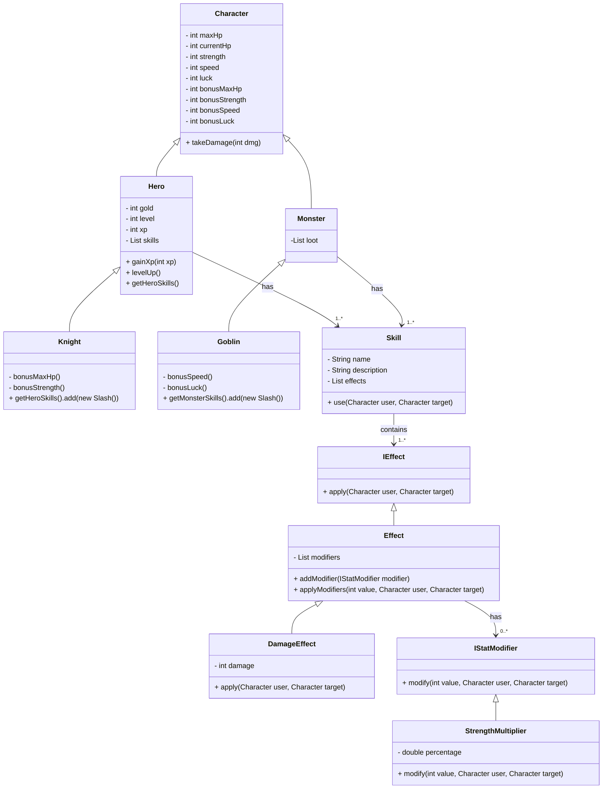
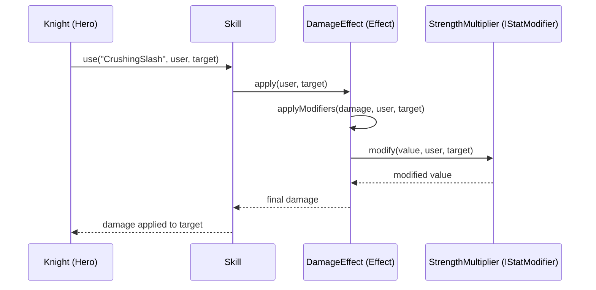

# 🏰 Heroes vs monsters

## Personnage

### **Character**
- Propriétés : `maxHp`, `currentHp`, `strength`, `speed`, `luck`, bonus de stats 
- Méthodes : `takeDamage(int dmg)`  

---

##  Hero

### **Hero** (hérite de `Character`)
- Propriétés : `gold`, `level`, `xp`  
- Méthodes : `gainXp(int xp)`, `levelUp()`, `getHeroSkills()`, `setHeroSkills(List<Skill>)`  
- Contient une **liste de skills** (`List<Skill>`)

---

## Heros spécifique

### **Knight** (hérite de `Hero`)
- Bonus spécifiques :
  - `bonusMaxHp`
  - `bonusStrength`
- Skills ajoutés dans le constructeur, ex : `CrushingSlash`  

---

##  Monstre

### **Monster** (hérite de `Character`)
- Propriétés :
  - liste de loot (`List<Item>`)

---

## Monstres spécifique

### **Goblin** (hérite de `Monster`)
- Monstre rapide et chanceux  
- Bonus spécifiques :
  - `bonusSpeed`
  - `bonusLuck`
- Peut drop du loot (ex : item)

---

## Skills

### **Skill**
- Propriétés : `name`, `description`, `List<IEffect> effects`  
- Méthode : `use(Character user, Character target)`  
- Chaque skill peut contenir **un ou plusieurs effets**

---

## Effets

### **IEffect**
- Méthode : `apply(Character user, Character target)`

### **Effect** (abstrait, implémente IEffect)
- Propriétés : `List<IStatModifier> modifiers`  
- Méthodes :  
  - `addModifier(IStatModifier modifier)`  
  - `applyModifiers(int value, Character user, Character target)`  
- Permet d’appliquer plusieurs modificateurs empilés

### **DamageEffect** (hérite de Effect)
- Propriétés : `damage` (int)  
- Méthode `apply` calcule le **damage final** via les modificateurs et l’applique à la cible  

---

## Modificateurs de stats

### **IStatModifier**
- Méthode : `modify(int value, Character user, Character target)`

### **StrengthMultiplier** (implémente IStatModifier)
- Propriété : `percentage`  
- Méthode `modify` :  

```java
(int) (value * (1 + user.getStrength() * 0.01 * percentage))
```
- Transforme la **force du personnage** en multiplicateur de dégâts  

---

## Exemple de skill : CrushingSlash

```java
DamageEffect damageEffect = new DamageEffect(80);
damageEffect.addModifier(new StrengthMultiplier(0.7));
this.getEffects().add(damageEffect);
```

- Base damage : 80  
- Scaling avec force : 0.7  
- Ajouté directement à la liste des effets du skill

---

## Système d’Item

### Item (classe de base)
**Propriétés :**
- `name`
- `description`
- `goldValue`  

_Représente un objet générique du jeu_

### Types d’items

#### Equipment (hérite de Item)
- Donne des bonus de stats
- Peut être équipé  
**Exemples :**
- `Sword` → +strength
- `Armor` → +hp

#### Consumable (hérite de Item)
- Utilisable une seule fois
- Applique un effet  
**Exemples :**
- `Potion` → heal
- `Elixir` → boost temporaire

#### Material / LootItem (hérite de Item)
- Pas d’effet direct
- Sert pour :
  - vente
  - crafting
  - quêtes

---

## Système de Loot

### Loot (abstrait)
**Propriétés :**
- `dropChance`  

**Méthode :**
- `roll()` → détermine si le loot est obtenu

### ItemLoot (hérite de Loot)
- Contient :
  - un `Item`
  - une quantité (optionnel)  
_Permet de drop un objet_

### GoldLoot (hérite de Loot)
- Contient :
  - `minGold`
  - `maxGold`  
_Permet de générer une quantité d’or_

### LootTable
- Contient : `List<Loot>`  
**Méthode :**
- génère les récompenses après la mort du monstre

---

# Flux du loot

1. Monster meurt  
   → `LootTable.generateLoot()`  
     → retourne :
     - gold
     - items  
2. Hero reçoit :  
   - ajoute gold
   - ajoute items dans `inventory`

---

## Inventory

### Inventory
- Contient : liste ou map d’`Item`  

**Responsabilités :**
- ajouter un item
- gérer les stacks (quantité)
- retirer un item

---

# 🧠 Règles importantes
- Le gold n’est **PAS** un Item
- Le gold est stocké directement dans : `Hero.gold`
- L’inventaire contient uniquement des objets

---

## Diagramme : architecture complète



---

## Flux d’utilisation d’un skill (Sequence Diagram)



**Explications :**  
- **Knight** appelle `use` sur le skill.  
- **Skill** appelle `apply` sur chaque effet (ici `DamageEffect`).  
- **DamageEffect** utilise `applyModifiers` pour passer à travers tous les modificateurs.  
- **StrengthMultiplier** modifie la valeur selon la force du personnage.  
- La valeur modifiée remonte jusqu’au skill et est appliquée à la cible.  

---

### Résumé

- `Character` → base des stats  
- `Hero` → ajoute XP, level et skills  
- `Knight` → Hero spécialisé avec bonus + skill(s) initiales  
- `Skill` → contient effets  
- `Effect` → gère les modificateurs  
- `DamageEffect` → exemple concret d’effet  
- `IStatModifier` → modifie des valeurs selon des stats (ex: StrengthMultiplier)  

