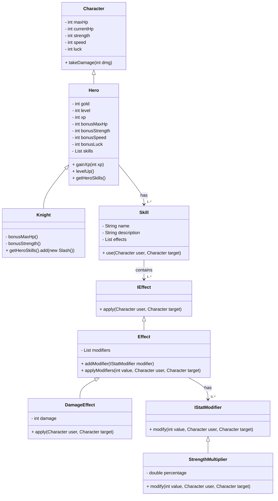
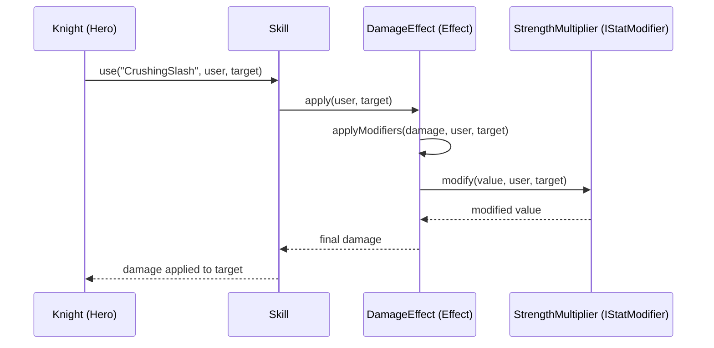

# 🏰 Heroes vs monsters

## Classes de base

### **Character**
- Propriétés : `maxHp`, `currentHp`, `strength`, `speed`, `luck`  
- Méthodes : `takeDamage(int dmg)`  

### **Hero** (hérite de `Character`)
- Propriétés : `gold`, `level`, `xp`, bonus de stats  
- Méthodes : `gainXp(int xp)`, `levelUp()`, `getHeroSkills()`, `setHeroSkills(List<Skill>)`  
- Contient une **liste de skills** (`List<Skill>`)

### **Knight** (hérite de `Hero`)
- Bonus spécifiques : `bonusMaxHp`, `bonusStrength`  
- Skills ajoutés dans le constructeur, ex : `CrushingSlash`

---

## Skills

### **Skill**
- Propriétés : `name`, `description`, `List<IEffect> effects`  
- Méthode : `use(Character user, Character target)`  
- Chaque skill peut contenir **un ou plusieurs effets**

---

## Effets

### **IEffect**
- Méthode : `apply(Character user, Character target)`

### **Effect** (abstrait, implémente IEffect)
- Propriétés : `List<IStatModifier> modifiers`  
- Méthodes :  
  - `addModifier(IStatModifier modifier)`  
  - `applyModifiers(int value, Character user, Character target)`  
- Permet d’appliquer plusieurs modificateurs empilés

### **DamageEffect** (hérite de Effect)
- Propriétés : `damage` (int)  
- Méthode `apply` calcule le **damage final** via les modificateurs et l’applique à la cible  

---

## Modificateurs de stats

### **IStatModifier**
- Méthode : `modify(int value, Character user, Character target)`

### **StrengthMultiplier** (implémente IStatModifier)
- Propriété : `percentage`  
- Méthode `modify` :  

```java
(int) (value * (1 + user.getStrength() * 0.01 * percentage))
```
- Transforme la **force du personnage** en multiplicateur de dégâts  

---

## Exemple de skill : CrushingSlash

```java
DamageEffect damageEffect = new DamageEffect(80);
damageEffect.addModifier(new StrengthMultiplier(0.7));
this.getEffects().add(damageEffect);
```

- Base damage : 80  
- Scaling avec force : 0.7  
- Ajouté directement à la liste des effets du skill

---

## Diagramme : architecture complète



---

## Flux d’utilisation d’un skill (Sequence Diagram)



**Explications :**  
- **Knight** appelle `use` sur le skill.  
- **Skill** appelle `apply` sur chaque effet (ici `DamageEffect`).  
- **DamageEffect** utilise `applyModifiers` pour passer à travers tous les modificateurs.  
- **StrengthMultiplier** modifie la valeur selon la force du personnage.  
- La valeur modifiée remonte jusqu’au skill et est appliquée à la cible.  

---

### Résumé

- `Character` → base des stats  
- `Hero` → ajoute XP, level et skills  
- `Knight` → Hero spécialisé avec bonus + skill(s) initiales  
- `Skill` → contient effets  
- `Effect` → gère les modificateurs  
- `DamageEffect` → exemple concret d’effet  
- `IStatModifier` → modifie des valeurs selon des stats (ex: StrengthMultiplier)  

